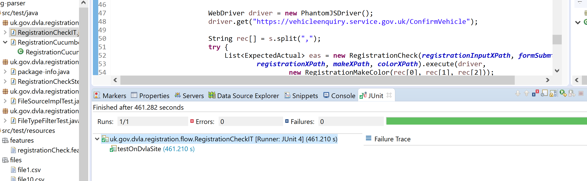
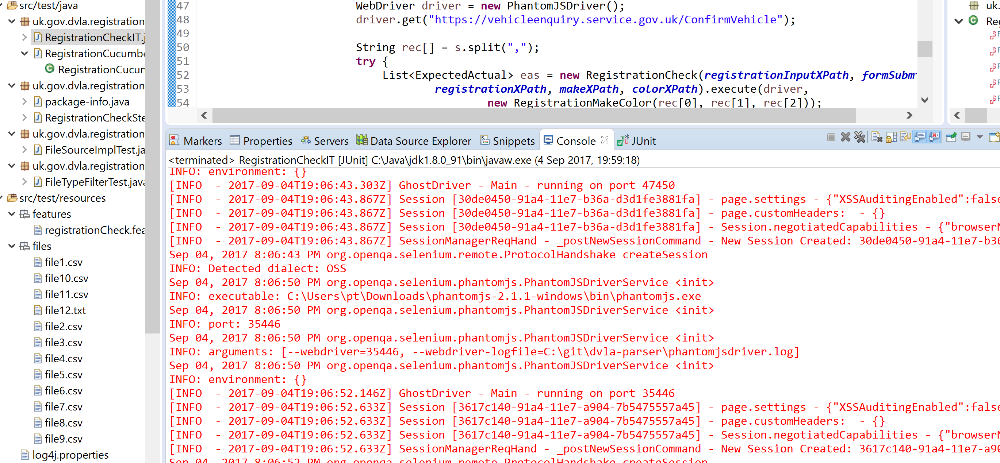
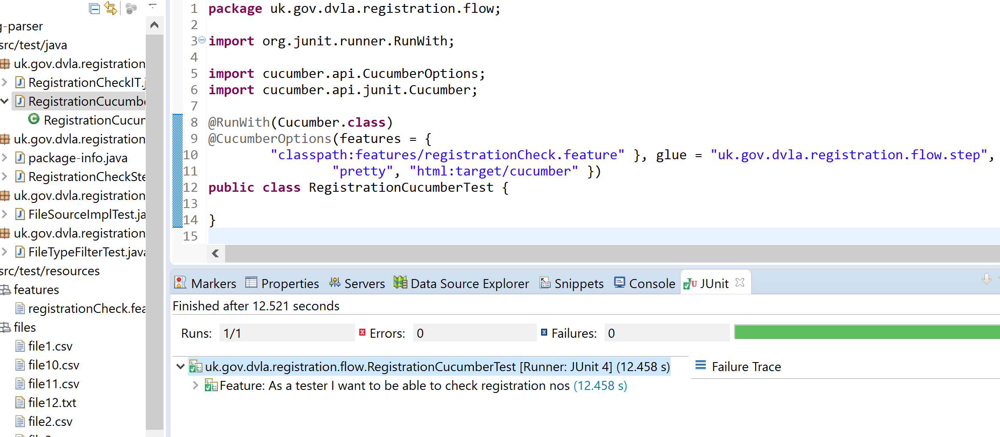

# DVLA vehicle enquiry

## Building it

Check out the github project and run a maven build

<code>
mvn clean package
</code>

## Integration Tests

### RegistrationCheckIT

This test reads files from the test/resources/files directory and checks the
DVLA website for registration details listed in the files

Screenshots of the test

### RegistrationCucumberTest

Add registration details to the datatable in the registrationCheck.feature file
prior to running this test.

Screenshots of the test

